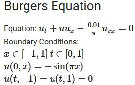

# PINN-PyTorch

This repo contains implementation in PyTorch of the Burger's Equation example put together by *Raissi et al.* in their original publication about Physics Informed Neural Networks (PINNs) 

 

The code uses a custom loss function that accounts for the physics as well (by leveraging the automatic differentiation ability of Neural Networks), apart from minimizing the error between predicted and training data. 

## Key Features

* Implemented the solution to Burgers Equation as well as Inverse problem using two approaches. 
* In the first approach **Mini-Batch Gradient Descent** is adopted along with **Adam optimizer**. 
* In the second approach LBFGS optimizer is adopted.
* Obsevered that the second approach outperforms the first. 

Link to the original publication : [https://maziarraissi.github.io/PINNs/](https://maziarraissi.github.io/PINNs/)
